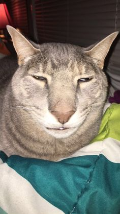

# Learning Markdown

## Silly Cat


## Code Snippets

Git Bash
``` bash
$ git init
Initialized empty Git repository in /Users/skills/Projects/recipe-repository/.git/
```

Javascript
``` javascript
var myVar = "Hello, world!";
```

Python
``` python
from math import sqrt
```

## Task List

- [x] This is marked down
- [ ] This one is not
- [x] this one is marked down as well
